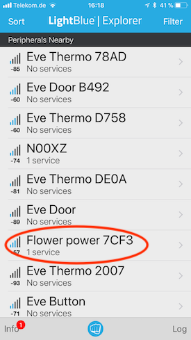

# Add your Flower Power device

Once you've installed the plugin you can add your Flower Power plant sensors to HomeKit.

## Sensor configuration

Each sensor is configured using the following structure:

```json
{
  "name": "Plant name as seen in HomeKit",
  "id": "FlowerPower Device Name"
}
```

The sensors are located using their advertised local name. The local name can either be seen
in the Parrot Flower Power app:


Or you can use an app (in this case [LightBlue Explorer](https://itunes.apple.com/us/app/lightblue-explorer/id557428110?mt=8) by [PunchThrough](https://punchthrough.com)) on your iOS device to locate the name of the Flower Power device.



## Example configuration using the above screen shots

```json
{
  "name": "My plant",
  "id": "Flower power 7CF3"
}
```

Once you've added your sensor to your config.json, it should look similar to the following:

```json
{
  "bridge": {
    "name": "Homebridge",
    "username": "xx:xx:xx:xx:xx:xx",
    "port": 52118,
    "pin": "135-79-864"
  },
  "platforms": [
    {
      "platform": "FlowerSensors",
      "sensors": [
        {
          "name": "Plant/Sensor name",
          "id": "Flower power 7CF3"
        }
      ]
    }
  ]
}
```

## Start homebridge

Now you're ready to start homebridge to monitor your Flower Power sensors, create
rules to monitor them and to integrate them into your home.

## Multiple sensors

Multiple sensors are supported, simply add each of them to the sensors section:

```json
{
  "bridge": {
    "name": "Homebridge",
    "username": "xx:xx:xx:xx:xx:xx",
    "port": 52118,
    "pin": "135-79-864"
  },
  "platforms": [
    {
      "platform": "FlowerSensors",
      "sensors": [
        {
          "name": "Plant/Sensor name",
          "id": "Flower power 7CF3"
        },
        {
          "name": "Plant/Sensor name 2",
          "id": "Flower power 3AD8"
        }
      ]
    }
  ]
}
```
